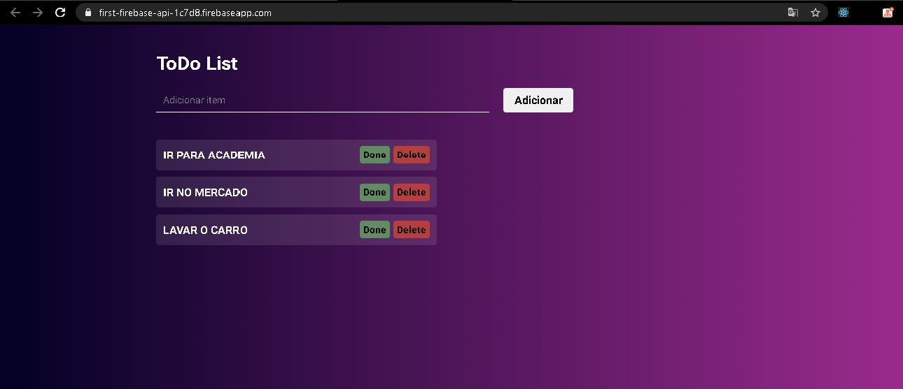

# Api-e-hosting-firebase
Apenas uma simples api de ToDos  utilizando cloud functions para a construção da api , o cloud firestore como banco de dados, e hosteando um mini site utilizando essa api com o firebase.
- https://first-firebase-api-1c7d8.firebaseapp.com/

## API END POINTS

### GET - Listar todos os items 
 - https://us-central1-first-firebase-api-1c7d8.cloudfunctions.net/App/api/read
 
retorna todos os itens no formato de array de objetos
	
### Post - Criar um item 
 - https://us-central1-first-firebase-api-1c7d8.cloudfunctions.net/App/api/create
 
   corpo da requisição:
	{
	"item":"foo bar"
	}

retorna uma mensagem de item criado

### GET - Listar um item 
 - https://us-central1-first-firebase-api-1c7d8.cloudfunctions.net/App/api/read/{item_id}

retorna um item no formato de objeto

### PUT - Atualizar item
 - https://us-central1-first-firebase-api-1c7d8.cloudfunctions.net/App/api/update/{item_id}

	corpo da requisição:
	{
	"item":"bar foo"
	}

retorna uma mensagem de item atualizado

### DELETE - Deletar item 
 - https://us-central1-first-firebase-api-1c7d8.cloudfunctions.net/App/api/delete/{item_id}

retorna uma mensagem de item deletado
